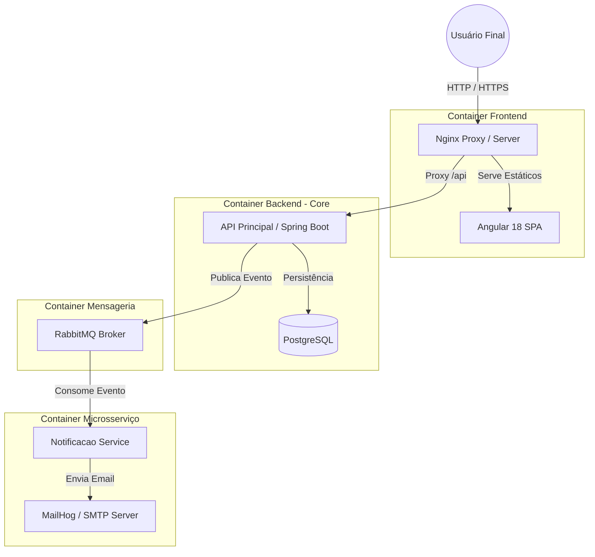

# ⛽ HubStation - Enterprise Fuel Management Platform

<div align="center">


</div>

> **HubStation** é uma plataforma _Full Stack_ distribuída para gestão de postos de serviços modernos ("Hubs de Energia"). O projeto implementa uma arquitetura baseada em eventos (Event-Driven), garantindo integridade financeira, auditabilidade e alta disponibilidade via Docker.

---

## 🏗️ Arquitetura da Solução

O sistema foi desenhado seguindo os princípios de **Microsserviços** e **Clean Architecture**. A comunicação entre o Frontend e o Backend é mediada por um Proxy Reverso (Nginx), enquanto a comunicação entre serviços internos ocorre via Mensageria Assíncrona (RabbitMQ).



---

## 🚀 Tecnologias & Ferramentas

### Backend & Dados

- **Java 17 (LTS):** Linguagem robusta e tipada.
- **Spring Boot 3.3:** Framework para microsserviços.
- **Spring Data JPA:** Abstração de persistência.
- **Flyway:** Versionamento de banco de dados (Migrations).
- **PostgreSQL 16:** Banco de dados relacional.
- **RabbitMQ:** Broker de mensagens para arquitetura assíncrona.
- **Spring Security:** Autenticação e proteção de endpoints.

### Frontend

- **Angular 18:** Framework SPA moderno (Standalone Components).
- **Angular Material (MDC):** Design System Enterprise.
- **RxJS & Signals:** Gerenciamento de estado reativo.
- **NGX-Mask:** Tratamento de inputs e máscaras.

### DevOps & Infra

- **Docker & Docker Compose:** Orquestração de containers.
- **Nginx:** Servidor web de alta performance e Reverse Proxy.
- **MailHog:** Teste de envio de e-mails em ambiente dev.

---

## 🧠 Desafios Técnicos & Soluções (Deep Dive)

Durante o desenvolvimento, enfrentamos desafios arquiteturais complexos. Abaixo, detalhamos como superamos os principais obstáculos com código limpo.

### 1\. Comunicação Assíncrona e Serialização JSON

**O Desafio:** O Spring AMQP, por padrão, serializa objetos Java. Precisávamos que o `notificacao-service` recebesse um JSON agnóstico para garantir interoperabilidade.
**A Solução:** Implementação de um `MessageConverter` customizado usando Jackson.

```java
// Arquivo: RabbitMQConfig.java
@Configuration
public class RabbitMQConfig {

    @Bean
    public MessageConverter jsonMessageConverter() {
        // Força o RabbitMQ a trafegar JSON legível, não bytes Java
        return new Jackson2JsonMessageConverter();
    }

    @Bean
    public Queue fidelidadeQueue() {
        // Garante que a fila seja durável (não perde dados se o broker reiniciar)
        return new Queue("fidelidade.v1.novo-cliente", true);
    }
}
```

### 2\. Imutabilidade Financeira (Soft Delete)

**O Desafio:** Em sistemas fiscais, deletar um registro de venda é uma falha grave de auditoria.
**A Solução:** Implementação do padrão **State Pattern**. O endpoint `DELETE` foi removido para abastecimentos, substituído por um `PATCH /cancelar` que altera o estado da entidade.

```java
// Arquivo: AbastecimentoServiceImpl.java
@Override
@Transactional
public AbastecimentoResponseDTO cancelar(Long id) {
    Abastecimento abastecimento = findEntityById(id);

    // Regra de Negócio: Idempotência
    if (abastecimento.getStatus() == StatusAbastecimento.CANCELADO) {
        throw new BusinessException("Este abastecimento já se encontra cancelado.");
    }

    // Mudança de Estado (Auditável)
    abastecimento.setStatus(StatusAbastecimento.CANCELADO);
    return mapper.toResponseDTO(repository.save(abastecimento));
}
```

### 3\. Orquestração de Build do Frontend no Docker

**O Desafio:** O comando `ng serve` não é adequado para produção/containers, e o roteamento do Angular (SPA) quebrava ao recarregar a página.
**A Solução:** Criação de um Dockerfile **Multi-Stage**. Primeiro usamos Node.js para compilar o projeto, depois injetamos os artefatos em um servidor Nginx configurado para lidar com o roteamento SPA.

```dockerfile
# Stage 1: Build (Node 22 Alpine)
FROM node:22-alpine as build
WORKDIR /app
COPY package.json package-lock.json ./
RUN npm install --legacy-peer-deps
COPY . .
RUN npm run build -- --configuration production

# Stage 2: Runtime (Nginx Alpine)
FROM nginx:alpine
# Copia apenas os arquivos estáticos otimizados (leveza e performance)
COPY --from=build /app/dist/posto-combustivel-front/browser /usr/share/nginx/html
COPY nginx.conf /etc/nginx/nginx.conf
EXPOSE 80
```

---

## 📦 Como Executar o Projeto

O projeto é **100% containerizado**. Você não precisa instalar Java, Maven, Node ou Postgres na sua máquina. Apenas o Docker.

### Pré-requisitos

- Docker Desktop instalado e rodando.

### Passo a Passo

1.  **Clone o repositório:**

    ```bash
    git clone [https://github.com/Damasceno11/hubstation-enterprise-platform.git](https://github.com/Damasceno11/hubstation-enterprise-platform.git)
    cd hubstation-enterprise-platform
    ```

2.  **Crie o arquivo de segredos `.env` na raiz:**

    ```properties
    POSTGRES_USER=postgres
    POSTGRES_PASSWORD=postgres
    POSTGRES_DB=sistema_posto_db
    APP_DB_PASSWORD=postgres
    APP_SECURITY_USER=admin
    APP_SECURITY_PASSWORD=123456
    ```

3.  **Suba o ambiente (Magic Command):**

    ```bash
    docker-compose up --build -d
    ```

4.  **Acesse a Aplicação:**

    - **Frontend:** [http://localhost:4200](https://www.google.com/search?q=http://localhost:4200)
    - **Login:** `admin` / `123456`
    - **MailHog (E-mails):** [http://localhost:8025](https://www.google.com/search?q=http://localhost:8025)
    - **RabbitMQ:** [http://localhost:15672](https://www.google.com/search?q=http://localhost:15672)

---

## 📞 Autor

<div align="center">
  
  
  
  <h3>Pedro Paulo Damasceno Muniz</h3>
  <em>Full Stack Developer | Java & Angular Specialist</em>
  
  <br><br>

  <p>
    Desenvolvedor focado em arquitetura de software, clean code e soluções escaláveis.<br>
    Apaixonado por transformar requisitos complexos em sistemas elegantes e funcionais.
  </p>
  
  <div style="display: flex; justify-content: center; gap: 10px;">
    <a href="https://www.linkedin.com/in/pedro-damasceno-23b330150/" target="_blank">
      
    </a>
    <a href="https://github.com/Damasceno11" target="_blank">
      
    </a>
    <a href="mailto:pedropaulodamasceno@gmail.com">
      
    </a>
  </div>

</div>

<br>

<div align="center">
  <i>Desenvolvido com precisão contábil e paixão por tecnologia. 🚀</i>
</div>

---
