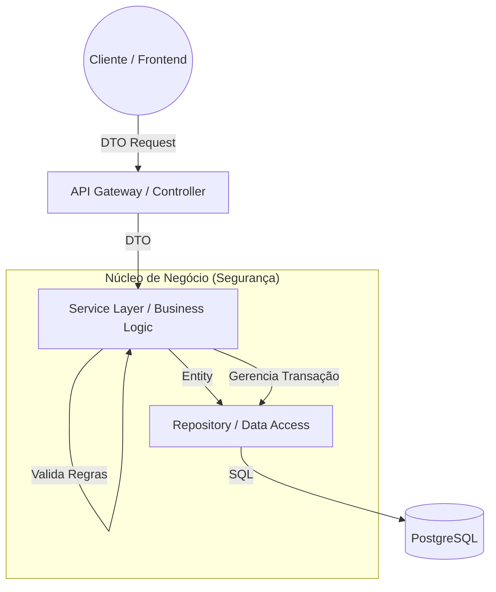
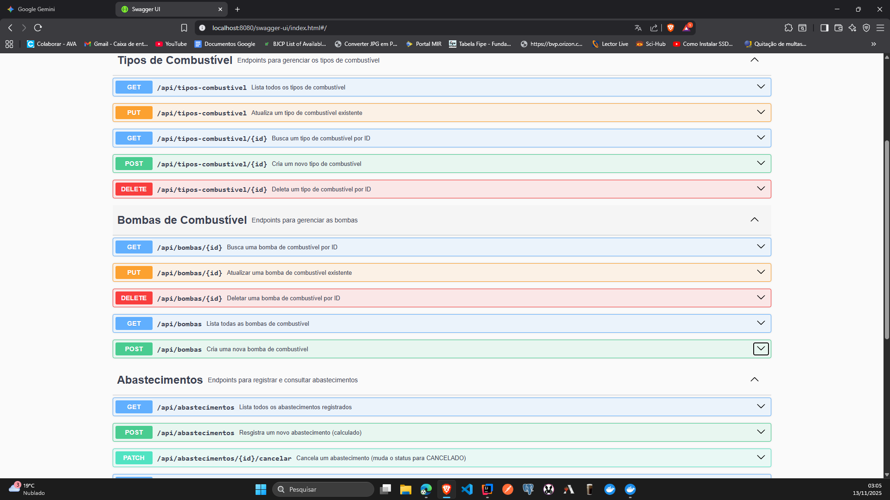
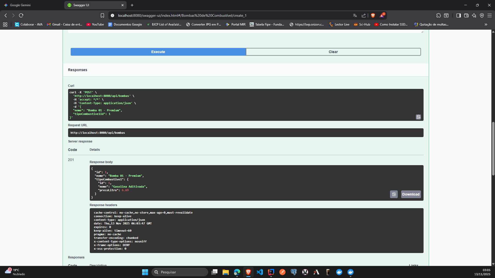
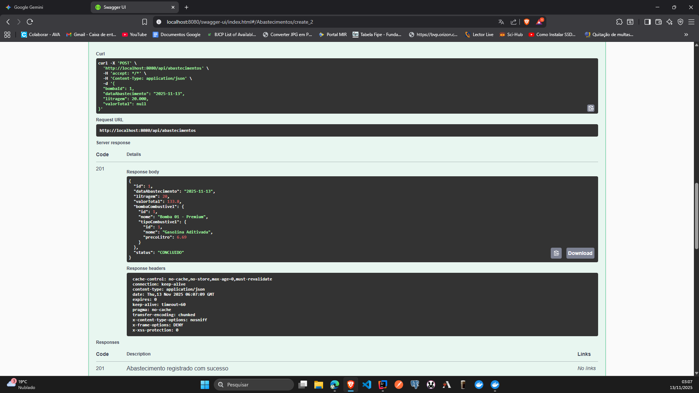
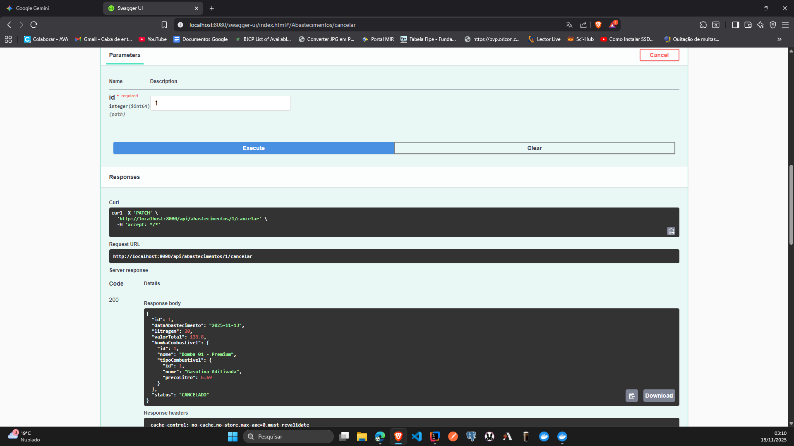

# ⛽ Sistema de Gestão de Posto de Combustível (API Enterprise)


> **Uma solução backend robusta focada em integridade financeira, imutabilidade de dados e arquitetura escalável.**

---

## 📖 Visão Geral do Projeto

Este projeto transcende o CRUD básico para resolver problemas reais de um domínio financeiro e logístico. O sistema gerencia o ciclo de vida de abastecimentos em um posto de combustível, garantindo que cálculos monetários sejam precisos e que o histórico de transações seja auditável.

O foco principal foi o desenvolvimento de uma aplicação **Enterprise-Ready**, utilizando práticas modernas de DevOps (Docker), versionamento de banco de dados (Flyway) e documentação viva (OpenAPI).

### 🎯 Diferenciais Técnicos

- **Arquitetura Limpa:** Separação estrita de responsabilidades entre Controladores, Serviços e Repositórios.
- **Imutabilidade de Negócio:** Abastecimentos registrados funcionam como lançamentos contábeis (ledger); não podem ser alterados, apenas cancelados.
- **Cálculo Seguro no Backend:** A lógica financeira reside 100% no servidor, prevenindo inconsistências de arredondamento vindas do frontend.
- **Ambiente Containerizado:** Setup completo (App + Banco) em um único comando via Docker Compose.

---

## 🏛️ Arquitetura e Design

A aplicação segue os princípios de **Layered Architecture** e **Domain-Driven Design (DDD)** tático.



---

## 🧠 Regras de Negócio e Soluções (Deep Dive)

Abaixo estão trechos reais do código que demonstram como problemas de negócio complexos foram resolvidos.

### 1\. Consistência Matemática e Precisão Decimal

**Desafio:** Permitir que o frentista informe a Litragem **OU** o Valor Total, mas nunca ambos (para evitar conflitos matemáticos), e garantir a precisão decimal correta (3 casas para litros, 2 para moeda).

**Solução:** Implementação de uma lógica de cálculo exclusiva na camada de serviço, utilizando `BigDecimal` e `RoundingMode` para precisão contábil.

```java
// Trecho de: AbastecimentoServiceImpl.java

private void calcularValores(Abastecimento abastecimento, BigDecimal precoLitro) {
    // Verifica qual dado foi enviado
    boolean hasLitragem = abastecimento.getLitragem() != null && abastecimento.getLitragem().compareTo(BigDecimal.ZERO) > 0;
    boolean hasValorTotal = abastecimento.getValorTotal() != null && abastecimento.getValorTotal().compareTo(BigDecimal.ZERO) > 0;

    // Regra de Negócio: Ambiguidade
    if (hasLitragem && hasValorTotal) {
        throw new BusinessException("Forneça apenas a litragem ou o valor total, não ambos para evitar inconsistências.");
    }

    // Cálculo Baseado na Litragem (Precision: 2 casas para R$)
    if (hasLitragem) {
        BigDecimal valorCalculado = abastecimento.getLitragem()
            .multiply(precoLitro)
            .setScale(2, RoundingMode.HALF_UP);
        abastecimento.setValorTotal(valorCalculado);
    }
    // Cálculo Baseado no Valor (Precision: 3 casas para Litros)
    else {
        BigDecimal litragemCalculada = abastecimento.getValorTotal()
            .divide(precoLitro, 3, RoundingMode.HALF_UP);
        abastecimento.setLitragem(litragemCalculada);
    }
}
```

### 2\. Imutabilidade e Auditoria (Soft Delete / State Change)

**Desafio:** Em sistemas financeiros, deletar registros é uma falha de segurança grave. Um abastecimento errado deve constar no histórico como "Cancelado".

**Solução:** Remoção dos endpoints `DELETE` e `PUT` para a entidade Abastecimento. Criação de um endpoint específico `PATCH /cancelar` que altera o estado da máquina de estados do objeto.

```java
// Trecho de: AbastecimentoServiceImpl.java

@Override
@Transactional
public AbastecimentoResponseDTO cancelar(Long id) {
    log.info("Iniciando cancelamento do abastecimento ID: {}", id);
    Abastecimento abastecimento = findEntityById(id);

    // Regra de Negócio: Idempotência e Estado
    if (abastecimento.getStatus() == StatusAbastecimento.CANCELADO) {
        throw new BusinessException("Este abastecimento já se encontra cancelado.");
    }

    // State Change
    abastecimento.setStatus(StatusAbastecimento.CANCELADO);

    Abastecimento abastecimentoCancelado = abastecimentoRepository.save(abastecimento);
    return mapper.toResponseDTO(abastecimentoCancelado);
}
```

### 3\. Tratamento Global de Erros (DX - Developer Experience)

**Desafio:** Exceções Java (Stack Traces) vazando para o cliente expõem vulnerabilidades e dificultam a integração com o Frontend.

**Solução:** Uso de `@RestControllerAdvice` para interceptar exceções e retornar um contrato JSON padrão e limpo.

```java
// Trecho de: GlobalExceptionHandler.java

@ExceptionHandler(ResourceNotFoundException.class)
public ResponseEntity<ErrorResponseDTO> handleResourceNotFoundException(
    ResourceNotFoundException ex, HttpServletRequest request) {

    // Logging estruturado para observabilidade interna
    log.warn("Recurso não encontrado: {}", ex.getMessage());

    // Resposta limpa para o consumidor da API
    ErrorResponseDTO error = new ErrorResponseDTO(
            Instant.now(),
            HttpStatus.NOT_FOUND.value(),
            "Not Found",
            ex.getMessage(),
            request.getRequestURI());

    return ResponseEntity.status(HttpStatus.NOT_FOUND).body(error);
}
```

---

## 🚀 Como Executar (DevOps & Docker)

O projeto foi desenhado para ser "agnóstico de ambiente". Você não precisa instalar Java ou Postgres na sua máquina.

### Pré-requisitos

- Docker & Docker Compose instalados.

### Passo a Passo

1.  **Clone o repositório:**

    ```bash
    git clone [https://github.com/Damasceno11/posto-combustivel-api.git](https://github.com/Damasceno11/posto-combustivel-api.git)
    cd posto-combustivel-api
    ```

2.  **Crie o arquivo de segurança `.env`:**
    Crie um arquivo `.env` na raiz com as credenciais (o Docker lerá este arquivo):

    ```properties
    POSTGRES_USER=postgres
    POSTGRES_PASSWORD=postgres
    POSTGRES_DB=posto_combustivel_db
    APP_DB_PASSWORD=postgres
    APP_SECURITY_USER=admin
    APP_SECURITY_PASSWORD=123456
    ```

3.  **Build e Deploy (Comando Único):**

    ```bash
    # Gera o pacote JAR e sobe os containers (API + Banco)
    ./mvnw clean package -DskipTests
    docker-compose up --build -d
    ```

4.  **Acesse a Documentação:**
    Abra `http://localhost:8080/swagger-ui.html`

---

## 🧪 Guia de Testes (Swagger)

Para interagir com a API protegida, siga este fluxo ilustrado abaixo:

1.  **Visão Geral e Autenticação:** Acesse a documentação e clique em **Authorize** (`admin` / `123456`).
2.  **Crie um Combustível:** Use o `POST /api/tipos-combustivel` para definir o preço e nome.
3.  **Registre um Abastecimento:** No `POST /api/abastecimentos`, envie apenas a `litragem` e veja o `valorTotal` ser calculado automaticamente.
4.  **Auditoria e Cancelamento:** Use o `PATCH /.../cancelar` para mudar o status de um registro para `CANCELADO`.

---

<div align="center">
  
  <br><br> 
  
  
  <br><br>
  
  
  <br><br>
  
  
</div>

---

## 🛠️ Tech Stack Detalhado

| Tecnologia            | Função          | Justificativa                                              |
| :-------------------- | :-------------- | :--------------------------------------------------------- |
| **Java 17**           | Linguagem       | Versão LTS robusta e moderna com Records.                  |
| **Spring Boot 3.3**   | Framework       | Padrão de mercado para microsserviços produtivos.          |
| **Spring Data JPA**   | Persistência    | Abstração eficiente para acesso a dados.                   |
| **PostgreSQL 16**     | Banco de Dados  | Relacional, robusto e open-source.                         |
| **Flyway**            | Migrations      | Versionamento de schema do banco (Infrastructure as Code). |
| **Docker Compose**    | Containerização | Orquestração de ambiente de desenvolvimento isolado.       |
| **Spring Security**   | Segurança       | Proteção de endpoints e autenticação.                      |
| **OpenAPI (Swagger)** | Documentação    | Documentação viva e testável da API.                       |
| **JUnit 5 & Mockito** | Testes          | Garantia de qualidade e TDD.                               |
| **SLF4J**             | Logging         | Observabilidade e rastreamento de erros.                   |

---

## 📞 Autor

<div align="center">
  <br>
  <b>Pedro Paulo Damasceno Muniz</b><br>
  <i>Full Stack Developer | Java & Angular Specialist</i>
</div>

<br>

Desenvolvedor focado em arquitetura de software, clean code e soluções escaláveis. Apaixonado por transformar requisitos complexos em sistemas elegantes e funcionais.

<div align="center">

[](https://www.linkedin.com/in/pedro-damasceno-23b330150/)
[](https://github.com/Damasceno11)
[](mailto:pedropaulodamasceno@gmail.com)

</div>

---

<div align="center">
  <i>Desenvolvido com precisão contábil e paixão por tecnologia.</i>
</div>
